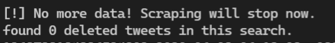
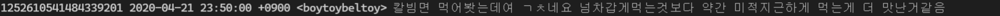
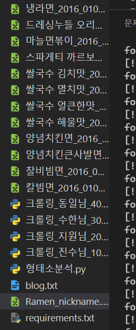
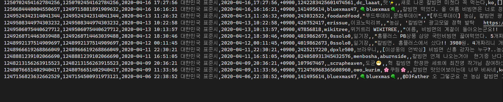

# README

1. git clone https://github.com/Leeyounwoo/Twitter-Crawling-and-morphological-analysis.git

2. pip install requirements.txt

3. 크롤링_${본인이름}.py 실행

   ```txt
   CRITICAL:root:twint.run:Twint:Feed:noDataExpecting value: line 1 column 1 (char 0)
   sleeping for 1.0 secs
   ```

   위와 같은 오류 발생시, twint 2.1.21 설치 필요 

   > pip uninstall twint
   > pip3 install --user --upgrade git+https://github.com/twintproject/twint.git@origin/master#egg=twint

4. 크롤링 성공 확인

   - 트윗 데이터가 없는 경우

     

   - 트윗 데이터가 있는 경우

     - 터미널

       

     - 디렉토리 구조

       

       - csv 파일 내부

         

       